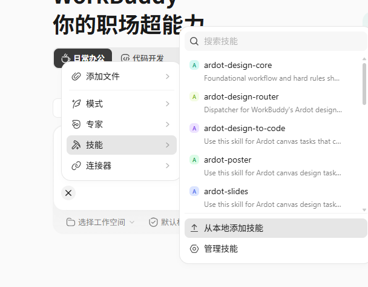
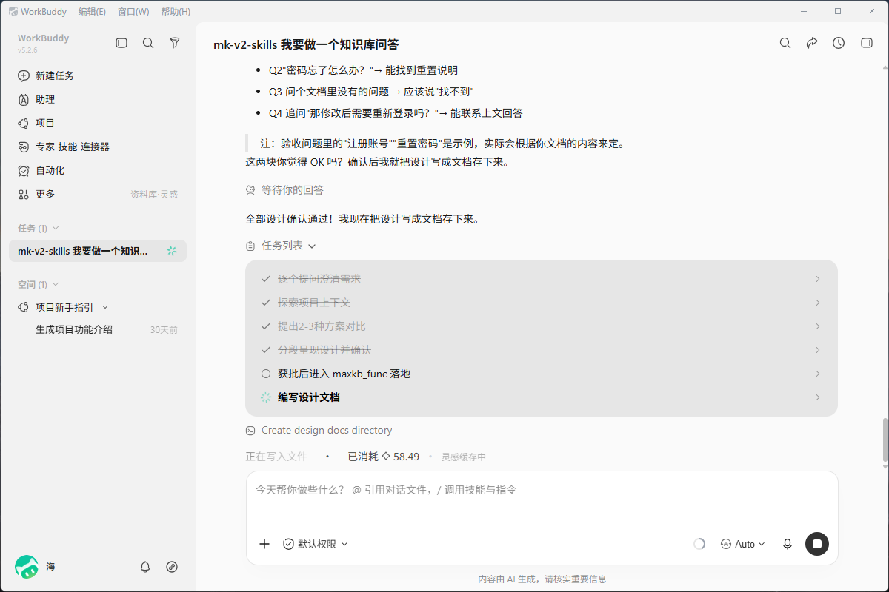
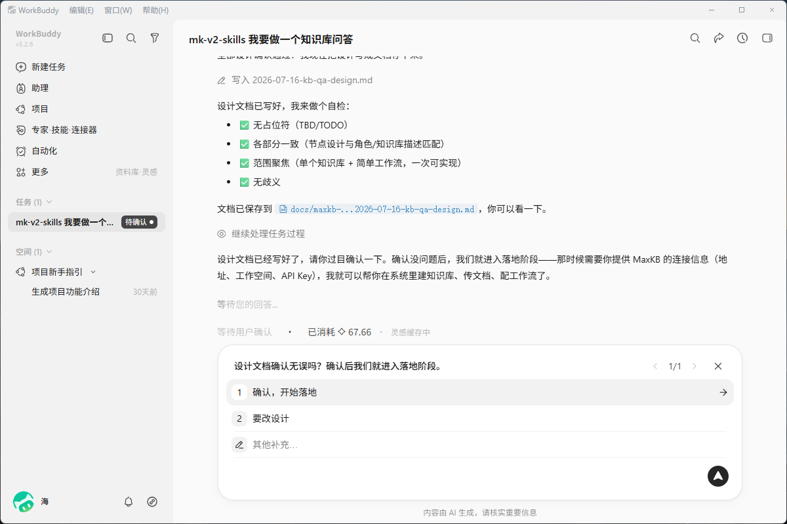
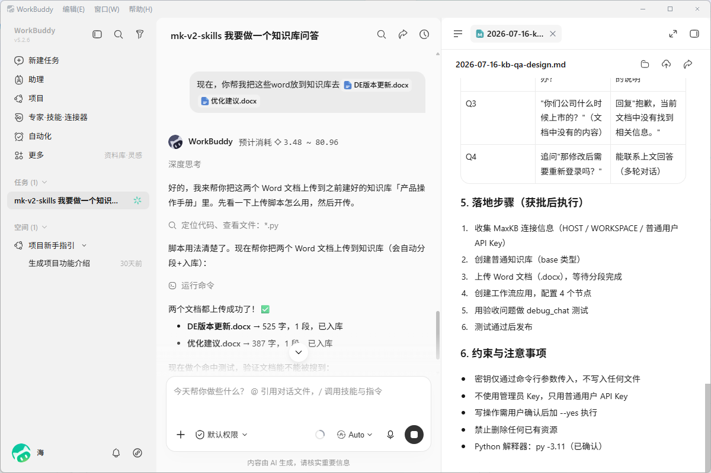
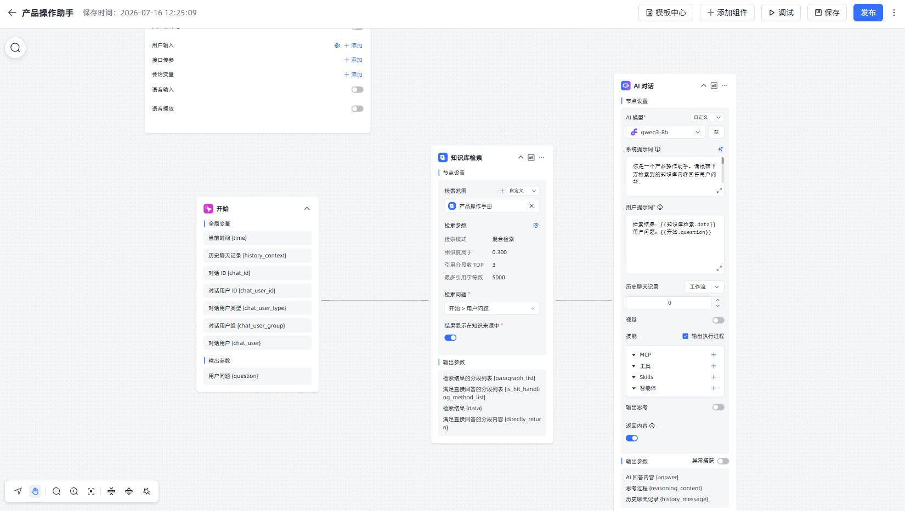

# mk_v2_skills

面向 **MaxKB v2** 的 Agent Skills 套件：让 AI 编程助手（Cursor、WorkBuddy 等）按规范帮你做需求澄清，并在 MaxKB 里创建/编排 **智能体（工作流）、知识库、工具**。

> 本文件介绍怎么用本套件。  
> 助手执行时的流程与安全约定见 [`SKILL.md`](SKILL.md)。接入时请把技能根目录指到本目录（`mk_v2_skills`）。

---

## 架构总览


可编辑源文件：[`docs/images/architecture/overview.html`](docs/images/architecture/overview.html)（未写入字体引用；导出时临时注入普惠体）。

---

## 能做什么

| 能力 | 说明 |
|------|------|
| **需求澄清** | 可选头脑风暴：把模糊需求谈成可落地的方案与验收问句 |
| **知识库** | 创建库、选向量模型、分段入库、命中测试（embedding / keywords / blend） |
| **智能体 / 工作流** | 创建高级编排应用、保存节点图、调试对话、发布、应用 API Key；AI 节点须含完整提示词（Role / 限制 / 输出 / 示例） |
| **工具** | 创建/调试自定义工具；说明沙箱限制（如默认禁止 subprocess） |
| **拓扑少样本** | 串行、并行、ReAct、规划/重规划、委派、记忆回流等 20 种设计骨架，便于选型 |
| **沟通模式** | 开场可选「编程小白」或「专业模式」，助手按你的背景调整讲解深度 |
| **脚本优先** | 用 Python CLI 调 MaxKB 当前管理端/对话 API，减少手写裸 HTTP |

官方 MaxKB 文档可参考：https://maxkb.cn/docs/v2/

---

## 智能体设计拓扑样本（20 种）

内置 **20+** 种智能体工作流拓扑少样本，便于头脑风暴选型后映射到 MaxKB 节点落地。完整设计思路、场景、要点与可解析 `work_flow` JSON 见目录：[`maxkb_func/maxkb-v2-workflow/topology-samples/`](maxkb_func/maxkb-v2-workflow/topology-samples/README.md)。

> 样本为**设计骨架**（含真实节点 `type`），不是一键可发布的生产图。落地时需补全模型 ID、知识库 ID、工具代码，并按规范为每个 AI 节点补全 **Role / 限制 / 输出 / 示例** 提示词。

| # | 拓扑 | 一句话说明 | 典型适用场景 | 样本文件 |
|---|------|------------|--------------|----------|
| 01 | **Sequential 串行** | 节点按固定顺序执行，上一步输出作为下一步输入 | 标准 RAG、单路径客服/问答 | [01-sequential](maxkb_func/maxkb-v2-workflow/topology-samples/01-sequential.md) |
| 02 | **Parallel 并行** | 同一上游扇出到多路同时计算，再汇合 | 多视角摘要、多策略同时算再汇总 | [02-parallel](maxkb_func/maxkb-v2-workflow/topology-samples/02-parallel.md) |
| 03 | **Loop 循环** | 对数组或次数重复执行同一子流程，可 break/continue | 列表逐条处理、批量工单 | [03-loop](maxkb_func/maxkb-v2-workflow/topology-samples/03-loop.md) |
| 04 | **Plan 规划分解** | 先生成计划，再按计划执行，最后综合 | 多步骤任务、先列提纲再落地 | [04-plan-decompose](maxkb_func/maxkb-v2-workflow/topology-samples/04-plan-decompose.md) |
| 05 | **Branch If-Else / Switch** | 按条件走不同出口；多分支近似 Switch | 意图分流、业务条件路由 | [05-branch-if-else-switch](maxkb_func/maxkb-v2-workflow/topology-samples/05-branch-if-else-switch.md) |
| 06 | **Merge / Join 汇聚** | 多条并行路径汇入同一节点（AND 全到齐 / OR 任一即可） | 多库检索合并、多源结果去重 | [06-merge-join](maxkb_func/maxkb-v2-workflow/topology-samples/06-merge-join.md) |
| 07 | **Retry 重试** | 失败后有限次再试，强调退出条件与兜底 | 不稳定外部工具、偶发超时 | [07-retry](maxkb_func/maxkb-v2-workflow/topology-samples/07-retry.md) |
| 08 | **Short-circuit 短路** | 早满足条件则提前结束，跳过昂贵后续节点 | 高置信直接回答、命中即返 | [08-short-circuit](maxkb_func/maxkb-v2-workflow/topology-samples/08-short-circuit.md) |
| 09 | **Cache Branch 缓存** | 先查缓存；命中短路返回，未命中计算后再回写 | 热点问法加速、重复查询降本 | [09-cache-branch](maxkb_func/maxkb-v2-workflow/topology-samples/09-cache-branch.md) |
| 10 | **ReAct 推理+行动** | Thought → Action → Observation 循环，直到可作答 | 联网问答、工具解题、查库再答 | [10-react](maxkb_func/maxkb-v2-workflow/topology-samples/10-react.md) |
| 11 | **Self-Plan + Replan** | 先 Plan，执行中发现异常/信息不足则 Replan | 旅游规划、开放式项目推进 | [11-self-plan-replan](maxkb_func/maxkb-v2-workflow/topology-samples/11-self-plan-replan.md) |
| 12 | **Hierarchical Plan 分层规划** | 顶层总规划 → 中层子任务 → 底层工具执行 | 论文、软件等超长复杂任务 | [12-hierarchical-plan](maxkb_func/maxkb-v2-workflow/topology-samples/12-hierarchical-plan.md) |
| 13 | **Tree-of-Thought 思维树** | 多分支并行推演多条解题路径，再择优 | 方案比选、多路径推演 | [13-tree-of-thought](maxkb_func/maxkb-v2-workflow/topology-samples/13-tree-of-thought.md) |
| 14 | **Graph-of-Thought 思维图** | 推理单元为图节点，可多入多出、交叉传信 | 多线索交叉推理、复杂关联分析 | [14-graph-of-thought](maxkb_func/maxkb-v2-workflow/topology-samples/14-graph-of-thought.md) |
| 15 | **Chain-of-Thought 思维链** | 串行分步推理，思考步骤内嵌在同一生成中 | 轻量分步推理、需要过程可见 | [15-chain-of-thought](maxkb_func/maxkb-v2-workflow/topology-samples/15-chain-of-thought.md) |
| 16 | **Adaptive Router 自适应路由** | 按任务难度/资源动态选择简单串行、复杂并行或规划 | 统一入口、按难度分流 | [16-adaptive-router](maxkb_func/maxkb-v2-workflow/topology-samples/16-adaptive-router.md) |
| 17 | **Throttle 资源限流** | 控制并行/并发数量，避免工具超限 | 批量处理控并发、API 配额受限 | [17-throttle](maxkb_func/maxkb-v2-workflow/topology-samples/17-throttle.md) |
| 18 | **Delegation 委派** | 主 Agent 拆任务，委派专用子 Agent，返回后汇总 | 主从专家协作、多角色分工 | [18-delegation](maxkb_func/maxkb-v2-workflow/topology-samples/18-delegation.md) |
| 19 | **Agent Sequential 流水线** | 多专职 Agent 串行流转 | 检索 → 分析 → 写作 → 审核 | [19-agent-sequential](maxkb_func/maxkb-v2-workflow/topology-samples/19-agent-sequential.md) |
| 20 | **Memory Feedback 记忆回流** | 独立记忆写入再读出参与推理（`{{开始.memory}}`） | 偏好/事实沉淀；勿与聊天记录、节点历史轮次混淆 | [20-memory-feedback](maxkb_func/maxkb-v2-workflow/topology-samples/20-memory-feedback.md) |

### 拓扑与 MaxKB 节点对照（速查）

| 拓扑概念 | 常用 MaxKB 节点 |
|----------|-----------------|
| 串行 | 普通边连接 |
| 并行 / 汇聚 | 一源多边；汇合边 `AND` / `OR` |
| 分支 / Switch | `condition-node` / `intent-node` |
| 循环 / Retry / ReAct | `loop-node` + break/continue |
| 规划 / CoT | 多个或单个 `ai-chat-node` |
| 委派 / 流水线 Agent | `application-node` |
| 缓存 / 限流 / 记忆落库 | `tool-node`（+ 条件） |
| 检索短路 | `search-knowledge-node` + `condition-node` + `reply-node` |

节点参数细节见 [`maxkb_func/maxkb-v2-workflow/nodes-reference.md`](maxkb_func/maxkb-v2-workflow/nodes-reference.md)。

---

## 目录结构

```text
mk_v2_skills/
├── README.md                 ← 使用说明（本文件）
├── SKILL.md                  ← 助手入口：开场流程、安全门禁、能力路由
├── docs/
│   └── images/               ← 配图（架构图、流程图、截图等）
│       ├── architecture/     ← 系统/套件架构图
│       ├── workflow/         ← 工作流与拓扑示意
│       ├── knowledge/        ← 知识库相关示意
│       ├── screenshots/      ← 操作截图（请打码密钥）
│       └── misc/             ← 其它配图
├── maxkb_func/               ← 落地执行：Python 脚本 + 子技能
│   ├── SKILL.md
│   ├── AUTH_AND_SAFETY.md    ← 认证与写操作风险说明
│   ├── SANDBOX.md            ← 工具沙箱限制
│   ├── examples.md           ← 脚本调用示例
│   ├── scripts/              ← 公共客户端与依赖
│   ├── maxkb-v2-workflow/    ← 工作流、节点说明、topology-samples/
│   ├── maxkb-v2-knowledge/   ← 知识库脚本与 API 对照
│   └── maxkb-v2-tools/       ← 工具脚本与 API 对照
└── superpowers-6.1.1/        ← 需求澄清（头脑风暴）用的规划能力
```

配图约定见 [`docs/images/README.md`](docs/images/README.md)。

---

## 环境要求

- **Python**：跑落地脚本需要 **≥ 3.11**（推荐 3.11）；助手会先帮你探测本机环境  
- **MaxKB**：专业版/企业版等支持用户 **API Key** 调管理端的实例（社区能力因版本而异）  
- **网络**：运行环境能访问你的 MaxKB 地址  
- **模型**：工作区内已配置可用的 **向量模型**（建库）与 **文本模型**（对话）

把完整技能包交给助手即可（请保留 `maxkb_func/scripts/`）。

---

## 快速上手

1. 把整个 `mk_v2_skills` 交给支持 Agent Skills 的客户端（或放到其技能搜索路径）。  
2. 在对话里说明要做智能体 / 知识库 / 工具。  
3. 按助手提问依次确认：  
   - 沟通模式（小白 / 专业）  
   - 本机 Python（必要时安装 3.11）  
   - 先头脑风暴还是直接制作
   - MaxKB 的 **HOST、工作空间、普通用户 API Key**  
4. 写操作（创建/更新/发布等）前，助手应再次请你确认；确认后才会带 `--yes` 执行脚本。  
5. **删除**更严格：助手默认不会删任何资源；只有你明确要求删除，并再次确认后才会执行。

手动跑脚本时（示例）：

```bash
cd maxkb_func
python -m venv .venv311
# Windows: .venv311\Scripts\pip install -r scripts/requirements.txt
# Unix:    .venv311/bin/pip install -r scripts/requirements.txt

python scripts/list_workspaces.py \
  --host https://your-maxkb.example.com \
  --workspace YourWorkspace \
  --api-key YOUR_USER_KEY
```

密钥请用命令行参数或当次环境变量传入；**不要**把 Key 写进 skill、示例或提交进 Git。本地虚拟环境目录（如 `.venv311/`）也不必提交。

---

## WorkBuddy 示例

1. **新建会话，上传/选择技能**



上传后，选择 `maxkb-v2-skills`（或本套件目录名）。

2. **提出需求**（可模糊、可精确，也可上传架构图/PRD）

模糊需求时，助手会引导你逐步澄清想法：



3. **使用过程**







可以把 Word、PDF 等直接交给助手做分段入库，也可协助上传/编排工作流知识库。

---

## 安全与责任

- 请使用 **普通用户** API Key，不要用管理员/超管 Key。  
- 应用对话用的 `agent-...` Key 与管理用 Key 不是同一种。  
- 本套件仅供参考；请优先在**测试环境**验证，再迁正式环境。误操作风险由操作方承担。详见 [`maxkb_func/AUTH_AND_SAFETY.md`](maxkb_func/AUTH_AND_SAFETY.md)。

---

## 参与与反馈

欢迎大家多提 [Issue](https://github.com/fit2cloud-east-de/mk_v2_skills/issues)：踩坑记录、能力缺口、文档不清、拓扑样本建议、新场景诉求都可以。  
反馈越多，项目越容易成熟，也更能助力更多人把 MaxKB 智能体、知识库与工具真正落地。

---

## License 与第三方

- MaxKB 为独立产品，请遵守其授权与部署条款。  
- `superpowers-6.1.1/` 为第三方组件，请遵守其自带许可证与说明。  
- 本套件其余内容的许可以本仓库根目录 LICENSE（如有）为准。
