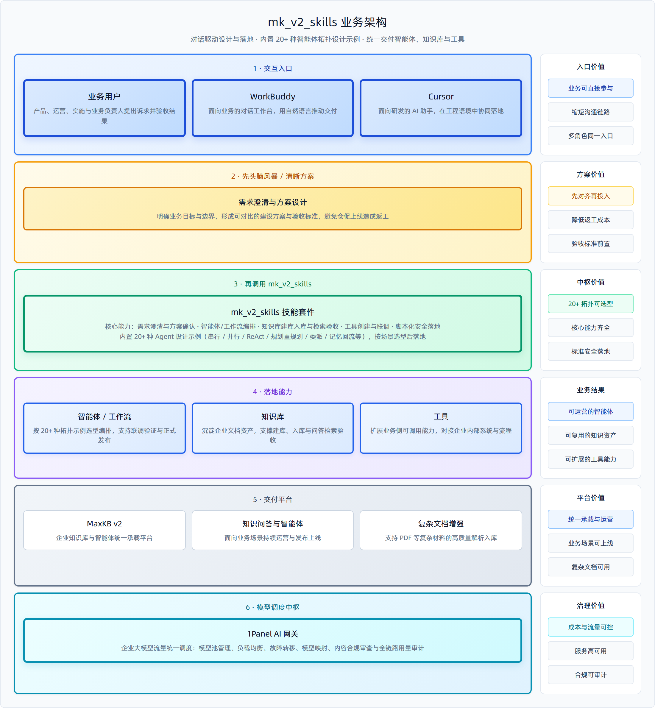

# mk_v2_skills

面向 **MaxKB v2** 的 Agent Skills 套件：让 AI 编程助手（Cursor、WorkBuddy 等）按规范帮你做需求澄清，并在 MaxKB 里创建/编排 **智能体（工作流）、知识库、工具**。

> 本文件介绍怎么用本套件。  
> 助手执行时的流程与安全约定见 [`SKILL.md`](SKILL.md)。接入时请把技能根目录指到本目录（`mk_v2_skills`）。

---

## 架构总览



可编辑源文件：[`docs/images/architecture/overview.html`](docs/images/architecture/overview.html)（未写入字体引用；导出时临时注入普惠体）。

---

## 能做什么

| 能力 | 说明 |
|------|------|
| **需求澄清** | 可选头脑风暴：把模糊需求谈成可落地的方案与验收问句 |
| **知识库** | 创建库、选向量模型、分段入库、命中测试（embedding / keywords / blend） |
| **智能体 / 工作流** | 创建高级编排应用、保存节点图、调试对话、发布、应用 API Key；AI 节点须含完整提示词（Role / 限制 / 输出 / 示例） |
| **工具** | 创建/调试自定义工具；说明沙箱限制（如默认禁止 subprocess） |
| **拓扑少样本** | 串行、并行、ReAct、规划/重规划、委派、记忆回流等 20 种设计骨架，便于选型 |
| **沟通模式** | 开场可选「编程小白」或「专业模式」，助手按你的背景调整讲解深度 |
| **脚本优先** | 用 Python CLI 调 MaxKB 当前管理端/对话 API，减少手写裸 HTTP |

官方 MaxKB 文档可参考：https://maxkb.cn/docs/v2/

---

## 目录结构

```text
mk_v2_skills/
├── README.md                 ← 使用说明（本文件）
├── SKILL.md                  ← 助手入口：开场流程、安全门禁、能力路由
├── docs/
│   └── images/               ← 配图（架构图、流程图、截图等）
│       ├── architecture/     ← 系统/套件架构图
│       ├── workflow/         ← 工作流与拓扑示意
│       ├── knowledge/        ← 知识库相关示意
│       ├── screenshots/      ← 操作截图（请打码密钥）
│       └── misc/             ← 其它配图
├── maxkb_func/               ← 落地执行：Python 脚本 + 子技能
│   ├── SKILL.md
│   ├── AUTH_AND_SAFETY.md    ← 认证与写操作风险说明
│   ├── SANDBOX.md            ← 工具沙箱限制
│   ├── examples.md           ← 脚本调用示例
│   ├── scripts/              ← 公共客户端与依赖
│   ├── maxkb-v2-workflow/    ← 工作流、节点说明、topology-samples/
│   ├── maxkb-v2-knowledge/   ← 知识库脚本与 API 对照
│   └── maxkb-v2-tools/       ← 工具脚本与 API 对照
└── superpowers-6.1.1/        ← 需求澄清（头脑风暴）用的规划能力
```

配图约定见 [`docs/images/README.md`](docs/images/README.md)。

---

## 环境要求

- **Python**：跑落地脚本需要 **≥ 3.11**（推荐 3.11）；助手会先帮你探测本机环境  
- **MaxKB**：专业版/企业版等支持用户 **API Key** 调管理端的实例（社区能力因版本而异）  
- **网络**：运行环境能访问你的 MaxKB 地址  
- **模型**：工作区内已配置可用的 **向量模型**（建库）与 **文本模型**（对话）

把完整技能包交给助手即可（请保留 `maxkb_func/scripts/`）。

---

## 快速上手

1. 把整个 `mk_v2_skills` 交给支持 Agent Skills 的客户端（或放到其技能搜索路径）。  
2. 在对话里说明要做智能体 / 知识库 / 工具。  
3. 按助手提问依次确认：  
   - 沟通模式（小白 / 专业）  
   - 本机 Python（必要时安装 3.11）  
   - 先头脑风暴还是直接制作
   - MaxKB 的 **HOST、工作空间、普通用户 API Key**  
4. 写操作（创建/更新/发布等）前，助手应再次请你确认；确认后才会带 `--yes` 执行脚本。  
5. **删除**更严格：助手默认不会删任何资源；只有你明确要求删除，并再次确认后才会执行。

手动跑脚本时（示例）：

```bash
cd maxkb_func
python -m venv .venv311
# Windows: .venv311\Scripts\pip install -r scripts/requirements.txt
# Unix:    .venv311/bin/pip install -r scripts/requirements.txt

python scripts/list_workspaces.py \
  --host https://your-maxkb.example.com \
  --workspace YourWorkspace \
  --api-key YOUR_USER_KEY
```

密钥请用命令行参数或当次环境变量传入；**不要**把 Key 写进 skill、示例或提交进 Git。本地虚拟环境目录（如 `.venv311/`）也不必提交。

---

WorkBuddy 示例
1. 新建会话，上传技能/选择技能
[`01-技能选择.png`](doc/images/workbuddy/01-技能选择.png)

上传后，选择 maxkb-v2-skills

2. 简单提需求/精确需求/上传架构图/PRD图
如果是模糊的需求，会引导你逐步确定你的想法
[`02-需求分析.png`](doc/images/workbuddy/02-需求分析.png)

3. 使用
[`03-问询式获取信息.png`](doc/images/workbuddy/03-问询式获取信息.png)

[`04-入库.png`](doc/images/workbuddy/04-入库.png)

[`05-简单工作流示例.png`](doc/images/workbuddy/05-简单工作流示例.png)
可以把word、pdf等直接传给ai让他帮你分段入库，也可以直接帮你上传/做工作流知识库。


---

## 安全与责任

- 请使用 **普通用户** API Key，不要用管理员/超管 Key。  
- 应用对话用的 `agent-...` Key 与管理用 Key 不是同一种。  
- 本套件仅供参考；请优先在**测试环境**验证，再迁正式环境。误操作风险由操作方承担。详见 [`maxkb_func/AUTH_AND_SAFETY.md`](maxkb_func/AUTH_AND_SAFETY.md)。

---

## License 与第三方

- MaxKB 为独立产品，请遵守其授权与部署条款。  
- `superpowers-6.1.1/` 为第三方组件，请遵守其自带许可证与说明。  
- 本套件其余内容的许可以本仓库根目录 LICENSE（如有）为准。
